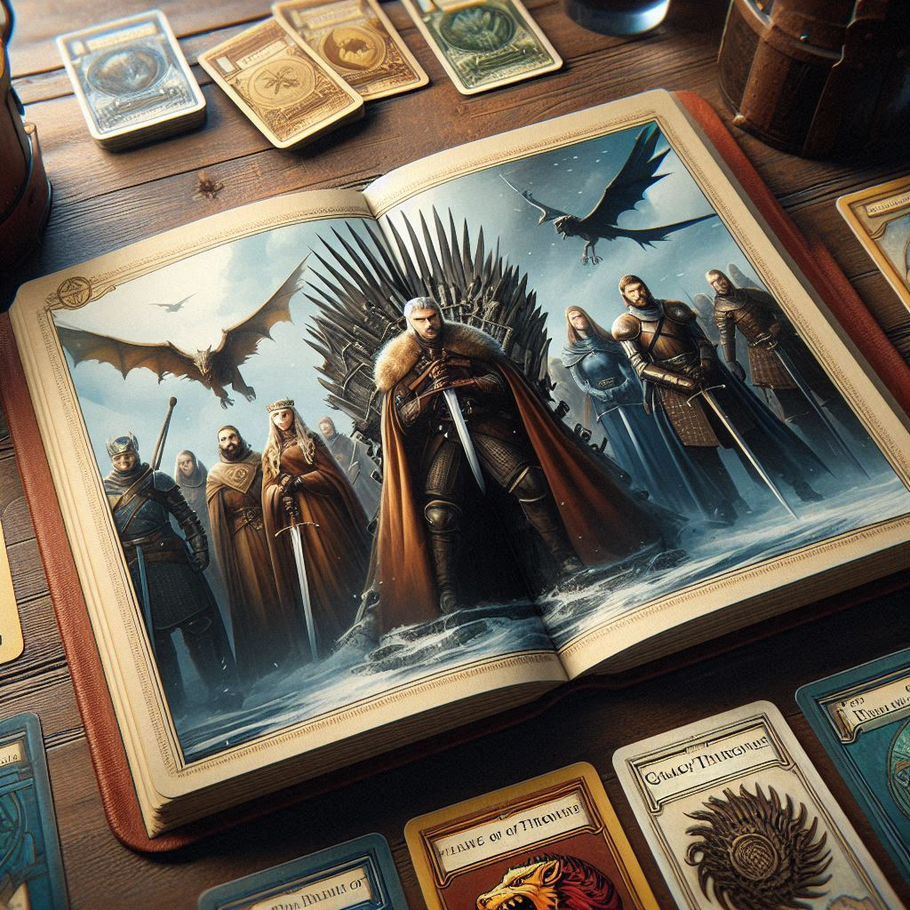

# Gwent Of Thrones

**Gwent Of Thrones** is an exciting card game that combines the strategic depth of Gwent from The Witcher with the epic universe of Game Of Thrones. Do you have what it takes to dominate the seven kingdoms through your cards? Prepare your deck, face your friends in epic duels, and prove your tactical prowess in a game that will challenge your strategic mind.

## Description

Gwent Of Thrones is a multiplayer card game for two players, where each match is an intense battle of wits. Each player starts with 10 cards and chooses their strategy to win rounds by accumulating the most power on the board. The game is inspired by the popular Gwent, but with a thematic twist that brings it into the gritty and ruthless world of Game Of Thrones.

### Game Features

   *  **Gwent-Inspired**: Follows the basic structure of Gwent, focusing on tactics and strategy.
   *  __Game Of Thrones Aesthetic__: Cards are designed with elements from the iconic universe of George R. R. Martin.
   *  __Online Multiplayer__: Challenge your friends in one-on-one matches.

## Installation

To install and play Gwent Of Thrones, follow these steps:

   1. **Clone the repository**:
     git clone https://github.com/mayjailerrr/gwent-2dd.git

   2. **System Requirements**:
     * You need to be on a Linux system to run the game.
     * Unity version 3.7.0 is required to open and build the project.

   3. **Dependencies**:
     No additional dependencies are required.

## How to Play

   1. **Starting the Game**:
     At the beginning of the game, each player draws 10 cards from their deck. They then have the option to swap up to 2 cards by right-clicking on them.

   2. **Gameplay**:
     * A turn consists of playing a card, using a leader ability, or passing.
     * Once both players pass, the round ends, and the player with the most power on the board wins the round.
     * The player who wins two rounds is declared the victor. In case of a tie, both players receive a round point.

   3. **Additional Rules**:
     * At the start of the second and third rounds, each player draws two additional cards.
     * You can only have a maximum of 10 cards in hand; any card drawn while at the limit will be discarded.

## Project Status

Gwent Of Thrones is currently in development. Future plans include integrating an interpreter so that players with programming knowledge can create and customize their own decks and card effects.

## Contributions

This project is open to contributions. If you're a student, developer, or just someone passionate about card games and programming, we'd love to have your collaboration! This is a completely student-driven, non-profit project.

## Credits

Developed by students of the Faculty of Mathematics and Computer Science at the University of Havana.

## Contact

Currently, there is no official contact channel. We welcome suggestions and feedback through issues and pull requests on GitHub!

